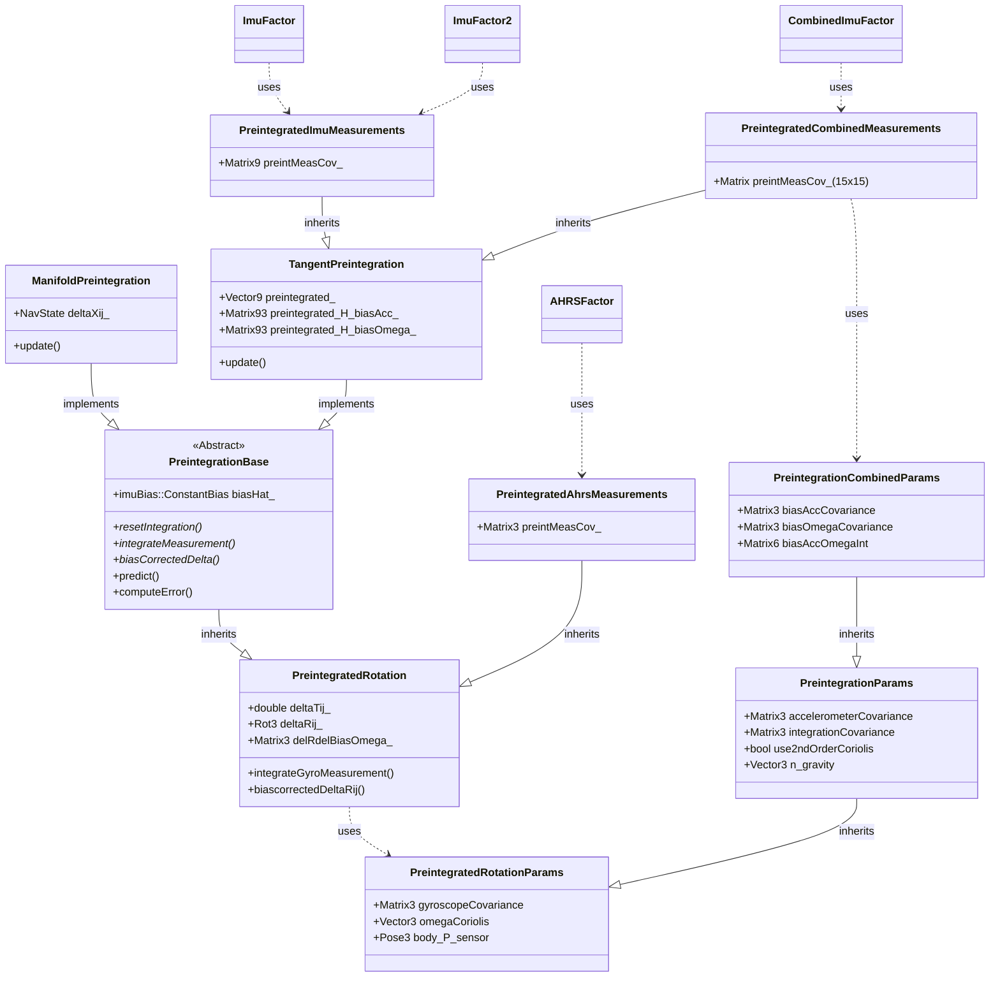

# Navigation

The `navigation` module in GTSAM provides specialized tools for inertial navigation, GPS integration, and sensor fusion. Here's an overview of key components organized by category:

## Core Navigation Types

- **[NavState](https://github.com/borglab/gtsam/blob/develop/gtsam/navigation/NavState.h)**: Represents the complete navigation state $\mathcal{SE}_2(3)$, i.e., attitude, position, and velocity. It also implements the group ${SE}_2(3)$.
- **[ImuBias](https://github.com/borglab/gtsam/blob/develop/gtsam/navigation/ImuBias.h)**: Models constant biases in IMU measurements (accelerometer and gyroscope).

## Attitude Estimation

- **[PreintegrationParams](https://github.com/borglab/gtsam/blob/develop/gtsam/navigation/PreintegrationParams.h)**: Parameters for IMU preintegration.
- **[PreintegratedRotation](https://github.com/borglab/gtsam/blob/develop/gtsam/navigation/PreintegratedRotation.h)**: Handles gyroscope measurements to track rotation changes.
- **[AHRSFactor](https://github.com/borglab/gtsam/blob/develop/gtsam/navigation/AHRSFactor.h)**: Attitude and Heading Reference System factor for orientation estimation.
- **[AttitudeFactor](https://github.com/borglab/gtsam/blob/develop/gtsam/navigation/AttitudeFactor.h)**: Factors for attitude estimation from reference directions.

## IMU Preintegration

- **[PreintegrationBase](https://github.com/borglab/gtsam/blob/develop/gtsam/navigation/PreintegrationBase.h)**: Base class for IMU preintegration classes.
- **[ManifoldPreintegration](https://github.com/borglab/gtsam/blob/develop/gtsam/navigation/ManifoldPreintegration.h)**: Implements IMU preintegration using manifold-based methods as in the Forster et al paper.
- **[TangentPreintegration](https://github.com/borglab/gtsam/blob/develop/gtsam/navigation/TangentPreintegration.h)**: Implements IMU preintegration using tangent space methods, developed at Skydio.
- **[CombinedImuFactor](https://github.com/borglab/gtsam/blob/develop/gtsam/navigation/CombinedImuFactor.h)**: Improved IMU factor with bias evolution.

## GNSS Integration

- **[GPSFactor](https://github.com/borglab/gtsam/blob/develop/gtsam/navigation/GPSFactor.h)**: Factor for incorporating GPS position measurements.
- **[BarometricFactor](https://github.com/borglab/gtsam/blob/develop/gtsam/navigation/BarometricFactor.h)**: Incorporates barometric altitude measurements.

## Simulation Tools

- **[Scenario](https://github.com/borglab/gtsam/blob/develop/gtsam/navigation/Scenario.h)**: Base class for defining motion scenarios.
- **[ConstantTwistScenario](https://github.com/borglab/gtsam/blob/develop/gtsam/navigation/Scenario.h)**: Implements constant twist (angular and linear velocity) motion.
- **[AcceleratingScenario](https://github.com/borglab/gtsam/blob/develop/gtsam/navigation/Scenario.h)**: Implements constantly accelerating motion.
- **[ScenarioRunner](https://github.com/borglab/gtsam/blob/develop/gtsam/navigation/ScenarioRunner.h)**: Executes scenarios and generates IMU measurements.

# IMU Factor and Preintegration Overview

This document provides an overview of the key classes involved in IMU preintegration and factor creation within the `gtsam/navigation` module. These components are essential for performing state estimation using Inertial Measurement Unit data, often fused with other sensors like cameras or GPS.

## Class Relationship Diagram (Mermaid)

