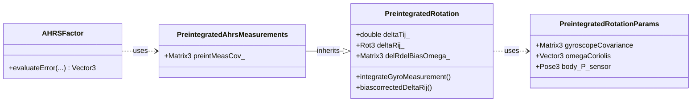

# Navigation

The `navigation` module in GTSAM provides specialized tools for inertial navigation, GPS integration, and sensor fusion. Here's an overview of key components organized by category:

## Classes
### Core Navigation Types

- **[NavState](https://github.com/borglab/gtsam/blob/develop/gtsam/navigation/NavState.h)**: Represents the complete navigation state $\mathcal{SE}_2(3)$, i.e., attitude, position, and velocity. It also implements the group ${SE}_2(3)$.
- **[ImuBias](https://github.com/borglab/gtsam/blob/develop/gtsam/navigation/ImuBias.h)**: Models constant biases in IMU measurements (accelerometer and gyroscope).

### Attitude Estimation

- **[PreintegrationParams](doc/PreintegrationParams.ipynb)**: Parameters for IMU preintegration.
- **[PreintegratedRotation](doc/PreintegratedRotation.ipynb)**: Handles gyroscope measurements to track rotation changes.
- **[AHRSFactor](doc/AHRSFactor.ipynb)**: Attitude and Heading Reference System factor for orientation estimation.
- **[AttitudeFactor](doc/AttitudeFactor.ipynb)**: Factors for attitude estimation from reference directions.

### IMU Preintegration (See also below)

- **[PreintegrationBase](https://github.com/borglab/gtsam/blob/develop/gtsam/navigation/PreintegrationBase.h)**: Base class for IMU preintegration classes.
- **[ManifoldPreintegration](https://github.com/borglab/gtsam/blob/develop/gtsam/navigation/ManifoldPreintegration.h)**: Implements IMU preintegration using manifold-based methods as in the Forster et al paper.
- **[TangentPreintegration](https://github.com/borglab/gtsam/blob/develop/gtsam/navigation/TangentPreintegration.h)**: Implements IMU preintegration using tangent space methods, developed at Skydio.
- **[ImuFactor](doc/ImuFactor.ipynb)**: IMU factor.
- **[CombinedImuFactor](doc/CombinedImuFactor.ipynb)**: IMU factor with built-in bias evolution.

### GNSS Integration

- **[GPSFactor](doc/GPSFactor.ipynb)**: Factor for incorporating GPS position measurements.
- **[BarometricFactor](doc/BarometricFactor.ipynb)**: Incorporates barometric altitude measurements.

### Magnetic Field Integration

- **[MagFactor](doc/MagFactor.ipynb)**: Factor for incorporating magnetic field measurements.
- **[MagPoseFactor](doc/MagPoseFactor.ipynb)**: Factor for incorporating magnetic field measurements with pose constraints.

### Simulation Tools

- **[Scenario](doc/Scenario.ipynb)**: Base class for defining motion scenarios.
- **[ConstantTwistScenario](https://github.com/borglab/gtsam/blob/develop/gtsam/navigation/Scenario.h)**: Implements constant twist (angular and linear velocity) motion.
- **[AcceleratingScenario](https://github.com/borglab/gtsam/blob/develop/gtsam/navigation/Scenario.h)**: Implements constantly accelerating motion.
- **[ScenarioRunner](doc/ScenarioRunner.ipynb)**: Executes scenarios and generates IMU measurements.

## AHRSFactor and Preintegration

This section describes the classes primarily involved in Attitude and Heading Reference Systems (AHRS), which rely on gyroscope measurements for orientation preintegration.

The key components are:

1.  **Parameters (`PreintegratedRotationParams`)**:
    *   Stores parameters specific to gyroscope integration, including gyro noise covariance, optional Coriolis terms, and the sensor's pose relative to the body frame.

2.  **Rotation Preintegration ([PreintegratedRotation](doc/PreintegratedRotation.ipynb))**:
    *   Handles the core logic for integrating gyroscope measurements over time to estimate the change in orientation (`deltaRij`).
    *   Calculates the Jacobian of this integrated rotation with respect to gyroscope bias (`delRdelBiasOmega`).

3.  **AHRS Preintegrated Measurements (`PreintegratedAhrsMeasurements`)**:
    *   Inherits from `PreintegratedRotation` and adds the calculation and storage of the covariance matrix (`preintMeasCov_`) associated with the preintegrated rotation.
    *   This class specifically accumulates the information needed by the `AHRSFactor`.

4.  **AHRS Factor ([AHRSFactor](doc/AHRSFactor.ipynb))**:
    *   A factor that constrains two `Rot3` orientation variables and a `Vector3` bias variable using the information accumulated in a `PreintegratedAhrsMeasurements` object.
    *   It effectively measures the consistency between the orientation change predicted by the integrated gyro measurements and the orientation change implied by the factor's connected state variables.

## IMU Factor and Preintegration

This section describes the classes involved in preintegrating full IMU measurements (accelerometer and gyroscope) for use in factors like `ImuFactor` and `CombinedImuFactor`.

The key components are:

1.  **Parameters (`...Params`)**:
    *   `PreintegratedRotationParams`: Base parameter class (gyro noise, Coriolis, sensor pose).
    *   `PreintegrationParams`: Adds accelerometer noise, gravity vector, integration noise.
    *   `PreintegrationCombinedParams`: Adds parameters for bias random walk covariance.

2.  **Preintegration Interface (`PreintegrationBase`)**:
    *   An abstract base class defining the common interface for different IMU preintegration methods. It manages the bias estimate used during integration (`biasHat_`) and the time interval (`deltaTij_`).
    *   Defines pure virtual methods for integration, bias correction, and state access.

3.  **Preintegration Implementations**:
    *   `ManifoldPreintegration`: Concrete implementation of `PreintegrationBase`. Integrates directly on the `NavState` manifold, storing the result as a `NavState`. Corresponds to Forster et al. RSS 2015.
    *   `TangentPreintegration`: Concrete implementation of `PreintegrationBase`. Integrates increments in the 9D tangent space of `NavState`, storing the result as a `Vector9`.

4.  **Preintegrated Measurements Containers**:
    *   `PreintegratedImuMeasurements`: Stores the result of standard IMU preintegration along with its 9x9 covariance (`preintMeasCov_`).
    *   `PreintegratedCombinedMeasurements`: Similar, but designed for the `CombinedImuFactor`. Stores the larger 15x15 covariance matrix (`preintMeasCov_`) that includes correlations with the bias terms.

5.  **IMU Factors (`...Factor`)**:
    * [ImuFactor](doc/ImuFactor.ipynb): A 5-way factor connecting previous pose/velocity, current pose/velocity, and a single (constant during the interval) bias estimate. Does *not* model bias evolution between factors.
    * [ImuFactor2](doc/ImuFactor.ipynb): A 3-way factor connecting previous `NavState`, current `NavState`, and a single bias estimate. Functionally similar to `ImuFactor` but uses the combined `NavState` type.
    * [CombinedImuFactor](doc/CombinedImuFactor.ipynb): A 6-way factor connecting previous pose/velocity, current pose/velocity, previous bias, and current bias. *Includes* a model for bias random walk evolution between the two bias states.

### Important notes
- Which implementation is used for `PreintegrationType` depends on the compile flag `GTSAM_TANGENT_PREINTEGRATION`, which is true by default.
    - If false, `ManifoldPreintegration` is used. Please use this setting to get the exact implementation from {cite:t}`https://doi.org/10.1109/TRO.2016.2597321`.
    - If true, `TangentPreintegration` is used. This does the integration on the tangent space of the NavState manifold.
- Using the combined IMU factor is not recommended. Typically biases evolve slowly, and hence a separate, lower frequency Markov chain on the bias is more appropriate.
- For short-duration experiments it is even recommended to use a single constant bias. Bias estimation is notoriously hard to tune/debug, and also acts as a "sink" for any modeling errors. Hence, starting with a constant bias is a good idea to get the rest of the pipeline working.

